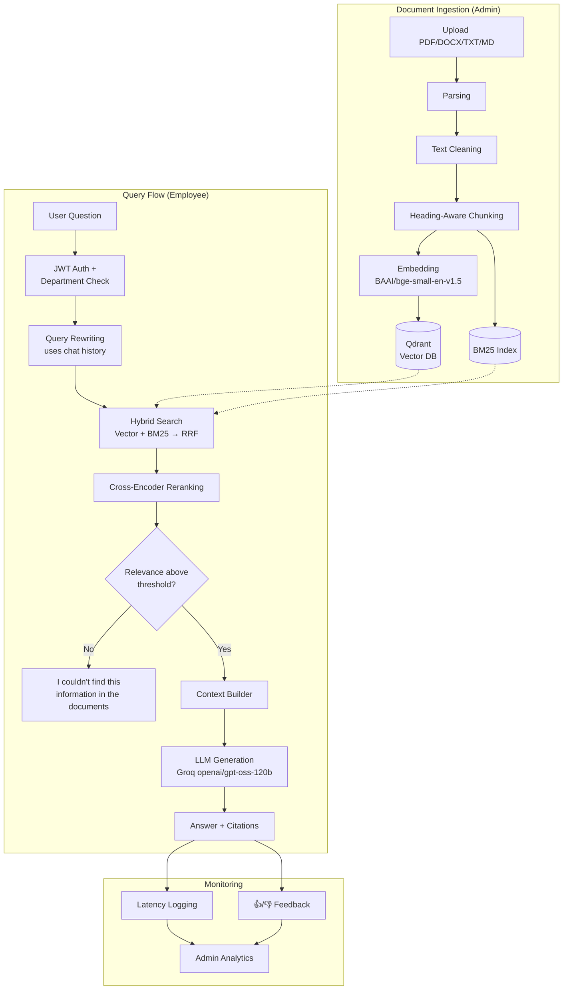

# Enterprise AI Knowledge Assistant

A production-style Retrieval-Augmented Generation (RAG) system that lets employees ask natural-language questions about their company's internal documents and get accurate, cited, hallucination-resistant answers — with department-based access control, an admin dashboard, and full Docker deployment.

Built as a fictional enterprise scenario for **NovaBridge Technologies Inc.**, covering HR, IT, and Company-wide policy documents.

---

## Why this project is different

Most "RAG demos" are a thin wrapper: `PDF → ChatGPT → Answer`. This project implements the full production pipeline:

```
Documents → Ingestion → Chunking → Embeddings → Hybrid Retrieval → Reranking
→ Context Building → LLM Generation → Citations → Evaluation → Monitoring → Deployment
```

## Key Features

- **Document Ingestion Pipeline** — PDF, DOCX, TXT, and Markdown support with parsing, cleaning, and heading-aware chunking
- **Hybrid Retrieval** — combines dense vector search (Qdrant) with BM25 keyword search, fused via Reciprocal Rank Fusion (RRF)
- **Cross-Encoder Reranking** — re-scores candidate chunks for precision before they reach the LLM
- **Hallucination Protection** — strict grounding rules in the generation prompt, plus a relevance-score threshold that rejects weak retrieval results before calling the LLM
- **Source Citations** — every answer cites the exact source document(s) it was built from
- **Conversational Chat** — multi-turn conversations with automatic query rewriting for follow-up questions
- **Multi-Tenant Access Control** — documents and users are scoped to departments (HR / IT / Company); an employee can only retrieve answers from documents their department is authorized to see
- **Authentication** — JWT-based auth with signup, login, and role-based access (admin vs. employee)
- **Admin Dashboard** — upload and index new documents, manage users and their department access, and view live system analytics
- **RAG Evaluation Suite** — a 61-question golden dataset with automated retrieval metrics (Hit Rate@k, MRR) and LLM-as-judge generation metrics (Faithfulness, Relevance)
- **Latency Monitoring & User Feedback** — every request logs retrieval/generation time; every answer can be rated 👍/👎, both surfaced in the admin Analytics tab
- **Full Docker Deployment** — one command (`docker compose up`) launches the backend, frontend, and vector database together

## Evaluation Results

Measured on a 61-question golden dataset covering all 16 source documents:

| Metric | Score |
|---|---|
| Hit Rate@6 (retrieval) | **100%** |
| MRR (retrieval ranking quality) | **0.975** |
| Faithfulness (1–5, LLM-judged) | **5.0** |
| Answer Relevance (1–5, LLM-judged) | **4.97** |

## Architecture



## Tech Stack

| Layer | Technology |
|---|---|
| Backend API | FastAPI |
| Vector Database | Qdrant |
| Keyword Search | BM25 (rank_bm25) |
| Embeddings | BAAI/bge-small-en-v1.5 (sentence-transformers) |
| Reranker | cross-encoder/ms-marco-MiniLM-L-6-v2 |
| LLM | Groq (openai/gpt-oss-120b) |
| Auth | JWT (python-jose) + bcrypt |
| Frontend | React + Vite |
| Containerization | Docker & Docker Compose |
| Provisioned (not yet integrated) | PostgreSQL, Redis |

## Project Structure

```
Enterprise AI Knowledge Assistant — RAG/
├── app/
│   ├── auth/            # JWT auth, user management
│   ├── core/             # shared state, conversations, metrics
│   ├── db/                # Qdrant client
│   ├── generation/        # LLM prompts, context building, query rewriting
│   ├── ingestion/          # parsing, cleaning, chunking, indexing
│   ├── retrieval/          # hybrid search + reranking
│   └── main.py             # FastAPI app & routes
├── frontend/                # React + Vite app (chat, admin dashboard, auth)
├── data/
│   ├── raw_documents/      # 16 source policy documents (HR/IT/Company)
│   ├── eval/                # golden_dataset.json + eval_results.json
│   └── processed/           # generated embeddings (gitignored)
├── scripts/                  # bulk_reindex, evaluate_rag, create_collection, etc.
├── Dockerfile
├── docker-compose.yml
└── requirements.txt
```

## Getting Started

### Prerequisites
- Docker Desktop
- A [Groq API key](https://console.groq.com)

### Setup

1. **Clone the repo**
   ```bash
   git clone https://github.com/saramhdsati/enterprise-ai-knowledge-assistant.git
   cd enterprise-ai-knowledge-assistant
   ```

2. **Configure environment variables**
   ```bash
   cp .env.example .env
   ```
   Then fill in `.env`:
   ```
   GROQ_API_KEY=your_groq_api_key_here
   APP_ENV=development
   JWT_SECRET_KEY=change_this_to_a_random_secret_key
   ```

3. **Build and launch all services**
   ```bash
   docker compose up -d --build
   ```

4. **Create the Qdrant collection and index the sample documents**
   ```bash
   python scripts/create_collection.py
   python scripts/bulk_reindex.py
   docker compose restart backend
   ```

5. **Open the app**
   - Frontend: [http://localhost:5173](http://localhost:5173)
   - API docs: [http://localhost:8000/docs](http://localhost:8000/docs)

### Stopping the project

```bash
docker compose down
```

## Usage

- **Sign up** for a new account — new users start with no department assigned.
- **Admins** assign departments to users from the **Manage Users** tab, and upload new documents (tagged by department) from **Upload Documents**.
- **Employees** can only retrieve answers from documents in their assigned department(s).
- Every answer includes its source document(s) and can be rated 👍/👎.
- Admins can monitor retrieval/generation latency and feedback satisfaction rate in the **Analytics** tab.

## Running the Evaluation Suite

```bash
python scripts/evaluate_rag.py
```

This runs all 61 questions in `data/eval/golden_dataset.json` against the live pipeline and writes detailed results (including per-question retrieval and LLM-judged scores) to `data/eval/eval_results.json`.

## Security Notes

- Passwords are hashed with bcrypt; JWTs are used for stateless authentication.
- Document access is enforced server-side at retrieval time — a compromised frontend cannot bypass department restrictions.
- Self-service signup does **not** allow users to choose their own department, preventing privilege escalation; an admin must explicitly grant access.

## Future Improvements

- Migrate user/conversation storage from JSON files to PostgreSQL (provisioned in `docker-compose.yml`, not yet wired up)
- Use Redis for response caching on repeated queries
- Add ablation experiments comparing retrieval strategies (vector-only vs. BM25-only vs. hybrid vs. hybrid+rerank)
- Add cost tracking per request (LLM token usage)

---

Built by [Sara Mohamed AL-Sati](https://github.com/saramhdsati)